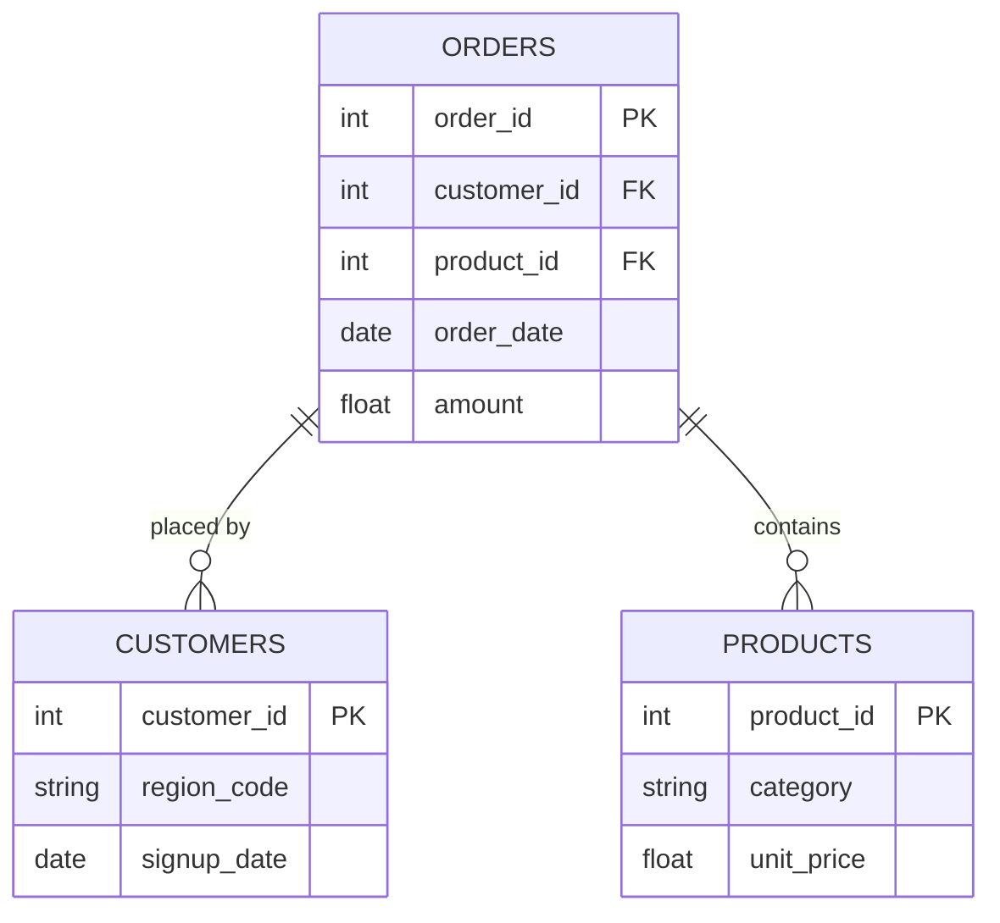

# MedioPharm Medical Center - Operational Efficiency & Patient Outcome Analysis 
> *The project aims to develop a comprehensive Power BI dashboard providing real-time insights into hospital operations and patient care, enabling stakeholders to monitor key indicators such as abnormal vital signs, readmissions, doctor response times, departmental workload, and patient outcomes.*

---

## ⚙️ Project Type Flags
> *Check what applies. This helps reviewers and collaborators understand the nature of the work at a glance. Delete this block before publishing.*

- [ ] Exploratory Data Analysis (EDA)
- [ ] Power BI Desktop
- [ ] Power Query – Data Cleaning and Transformation
- [ ] DAX (Data Analysis Expressions) – Creating Analytical Measures and KPIs
- [ ] Dashboard / Data Visualization
- [ ] Power BI Service – Publishing dashboards and enabling stakeholder access.

---

## Table of Contents
1. [Project Overview](#1-project-overview)
2. [Objectives](#2-objectives)
3. [Project Scope & Tools](#3-project-scope--tools)
4. [Data Workflow](#5-data-workflow)
6. [Data Model & Schema](#6-data-model--schema)
7. [ERD - Entity Relationship Diagram](#7-erd--entity-relationship-diagram) *(SQL projects)*
8. [Analysis & Metrics](#8-analysis--metrics)
9. [Key Insights](#9-key-insights)
10. [Recommendations](#10-recommendations)
11. [Assumptions & Limitations](#11-assumptions--limitations)
12. [Future Enhancements](#12-future-enhancements)
13. [Deliverables](#13-deliverables)
14. [Author](#14-author)

---

## 1. Project Overview

<!--
  Write 3–5 sentences in plain language.
  Cover: context → problem → approach → outcome.
  Read it out loud. If it sounds like a form - rewrite it.

  WHAT GOOD LOOKS LIKE:
  "A mid-size retail business was seeing inconsistent revenue across
  its regional stores but couldn't identify the root cause. This project
  explored 18 months of transaction data across five regions to determine
  whether underperformance was driven by sales volume, pricing, or return
  rates. The analysis revealed that one region's gap was almost entirely
  explained by an unusually high return rate on a single product category -
  a finding invisible in the company's top-level reporting."

  WHAT TO AVOID:
  "This project analyzes sales data to find trends and insights."
  (Too vague. Could describe 10,000 projects. Describes none of them.)
-->

MedioPharm Medical Center is a leading private healthcare institution that has evolved from a small general practice facility into a multi-specialty medical center over the past two decades. The hospital provides services across several departments including Cardiology, Pulmonology, Emergency Services, and Internal Medicine. 

MedioPharm Medical Center is experiencing increasing operational challenges such as rising emergency room traffic, growing patient readmission rates, delayed doctor response times, and inconsistent patient outcomes across departments. 

This project followed a structured sequence of analytical and technical phases to develop a comprehensive Power BI solution that provides hospital administrators and medical teams with real-time visibility into key performance indicators.

The analysis revealed a 6.63% readmission rate, with Emergency and Pulmonology recording the highest admissions. Flu, respiratory conditions, and hypertension were the leading diagnoses, while 2,138 patients recovered. However, 432 ICU cases, 189 readmissions, and 90 deaths highlight areas requiring further attention.

---

## 2. Objectives

<!--
  Write objectives that are specific enough to succeed or fail.
  Use action-oriented verbs: Identify, Determine, Quantify, Build, Evaluate.

  WHAT GOOD LOOKS LIKE:
  ✅ "Determine whether customer churn rate correlates with support ticket volume."
  ✅ "Identify the top three revenue-driving product categories across all regions."
  ✅ "Build a reproducible pipeline that ingests and cleans daily sales exports."

  WHAT TO AVOID:
  ❌ "Explore the data."
  ❌ "Gain insights."
  ❌ "Understand trends."
  (These can't fail - which means they can't succeed either.)
-->

- Analyze hospital operational data to identify inefficiencies in patient care processes
- Monitor emergency room load and patient flow trends
- Track patient readmission rates and patterns to identify potential causes
- Evaluate doctor response times and staff engagement efficiency
- Analyze patient vital signs data to identify potential health risk indicators
- Compare departmental performance and patient recovery outcomes
- Develop interactive Power BI dashboards to provide real-time insights for hospital management


---

## 3. Project Scope & Tools

### Scope

<!--
  WHAT GOOD LOOKS LIKE:
  In Scope: "Transaction-level data for Regions A–E, Jan 2023–Jun 2024.
             Analysis covers revenue, return rates, and product category performance."
  Out of Scope: "Customer demographics and marketing spend data were excluded -
                 demographic data was incomplete for two regions, and marketing
                 data sits in a separate system outside this engagement."

  WHAT TO AVOID:
  ❌ Leaving Out of Scope blank. This is the section that protects your credibility.
     If you don't define the fence, reviewers assume you missed things.
-->

| Dimension | Details |
|-----------|---------|
| **In Scope** | Patient demographics and visit trends, Department performance, Key healthcare performance indicators |
| **Out of Scope** | Individual patient identification, Clinical diagnosis or treatment recommendations, Predictive clinical decision-making |
| **Time Period** | January 2024 – August 2024 |
| **Granularity** | Unit of analysis - row-level, admissions, visit reason, departments, heart rate, oxygen saturation, body temperature |

### Tools & Technologies

<!--
  List only what you actually used on this project.
  This is not your skills section - it's the project's technical context.
-->

| Category | Tool(s) Used |
|----------|-------------|
| Data Storage | CSV files |
| Data Modeling & Analysis | Power BI Desktop |
| Data Cleaning and Transformation | Power Query |
| Analytical Measures | DAX (Data Analysis Expressions) |
| Visualization | Power BI |

---

## 4. Data Workflow

<!--
  Show how data moved through your project - from source to output.
  Every transformation decision should be traceable here.

  WHAT GOOD LOOKS LIKE:
  1. Source: "Monthly CSV exports pulled from the internal POS system.
              Five files, one per region, covering Jan 2023–Jun 2024."
  2. Ingestion: "Loaded into Python using pandas. Files concatenated into
                 a single dataframe (approx. 340,000 rows)."
  3. Cleaning: "Removed 1.2% of rows with null transaction IDs.
                Standardised date formats across regional files.
                Resolved product category naming inconsistencies (3 variants → 1)."
  4. Transformation: "Created a returns_rate field at product-category level.
                      Aggregated to weekly and regional grain for trend analysis."
  5. Analysis: "Descriptive statistics, regional comparison, return rate
                segmentation by product category."
  6. Output: "Summary report (PDF), annotated notebook, processed CSV."

  WHAT TO AVOID:
  ❌ "Data was cleaned and analysed." (No chain. No decisions. No trust.)
-->

```
[Data Source(s)]
      ↓
[Ingestion / Collection Method]
      ↓
[Cleaning & Transformation]
      ↓
[Analysis / Modelling / Querying]
      ↓
[Output / Visualisation / Reporting]
```

1. **Source:** Data was extracted from a data warehouse and provided as a CSV file
2. **Ingestion:** The CSV file was downloaded and imported into Power BI for analysis
3. **Cleaning:** Standardized data formats, corrected date/time fields, column structure, and missing/invalid values.
4. **Validation:** Check data accuracy, consistency, duplicates, missing values, and data types
5. **Transformation:** Created calculated fields including visit hour, length of stay, response category, age group, and a calendar table for time-based analysis
6. **Analysis:** Used DAX and Power BI to create measures, build data models, and analyze patient visits, department performance, wait times, length of stay, and demographics.
7. **Output:** Developed an interactive Power BI dashboard presenting key performance indicators, trends, and actionable insights for MedioPharm Medical Center.


---

## 7. ERD - Entity Relationship Diagram

<!--
  An ERD shows how your tables connect to each other visually.
  It is the fastest way for a reviewer to understand the data structure
  of a SQL project without reading every query.

  HOW TO INCLUDE YOUR ERD:
  Option A - Image embed (most common):
    Export your ERD from dbdiagram.io, DBeaver, Lucidchart, or similar.
    Save to /visuals/erd.png and reference it below.

  Option B - dbdiagram.io code block (version-controllable):
    Paste your schema definition code directly in the fenced block below.
    Anyone can paste it into dbdiagram.io to regenerate the visual.

  Option C - Mermaid diagram (renders natively in GitHub):
    Use the mermaid code block syntax below.
    GitHub will render this as a diagram automatically.

  PICK ONE. Don't use all three. Delete the options you don't use.
-->


* Four-table schema - patients, admissions, vitals, and doctor visits joined on shared IDs.

---

### Option B - dbdiagram.io Schema Definition
```
Table orders {
  order_id    int     [pk]
  customer_id int     [ref: > customers.customer_id]
  product_id  int     [ref: > products.product_id]
  order_date  date
  amount      float
}

Table customers {
  customer_id int  [pk]
  region_code string
  signup_date date
}

Table products {
  product_id   int    [pk]
  category     string
  unit_price   float
}
```
*Paste this into [dbdiagram.io](https://dbdiagram.io) to view the visual.*

---

### Option C - Mermaid Diagram *(renders on GitHub)*


---

**Table Relationships Summary:**

| Relationship | Join Key | Type |
|-------------|----------|------|
| `orders` → `customers` | `customer_id` | Many-to-One |
| `orders` → `products` | `product_id` | Many-to-One |
| [Add rows as needed] | | |

---

## 8. Analysis & Metrics

<!--
  Explain what you measured and how - before you share what you found.

  WHAT GOOD LOOKS LIKE:
  Metric: "Customer Return Rate"
  Definition: "Number of transactions flagged as returns divided by total
               transactions, calculated at product-category and regional grain."
  Why It Matters: "Return rate - not sales volume - was hypothesised to
                  explain regional revenue gaps. This metric tests that hypothesis."

  WHAT TO AVOID:
  ❌ Defining a metric only in code: SUM(returns) / COUNT(transaction_id)
     That's an implementation. Write the plain-language definition here.
     Both belong in your project - the definition in the README,
     the implementation in the code.
-->

### Analytical Approach

[Describe how you approached the analysis. Were you exploring patterns? Testing a hypothesis? Building and validating a pipeline? Be honest about your method - exploratory work is valid, just call it that.]

### Key Metrics Defined

| Metric | Plain-Language Definition | Why It Matters |
|--------|--------------------------|----------------|
| `[Metric 1]` | [What it measures, in one sentence] | [What decision or question it answers] |
| `[Metric 2]` | [What it measures, in one sentence] | [What decision or question it answers] |
| `[Metric 3]` | [What it measures, in one sentence] | [What decision or question it answers] |

### Methods Used

- [e.g., Descriptive statistics - distribution, central tendency, outlier detection]
- [e.g., Trend analysis across [time period]]
- [e.g., Segmentation / group comparison by [dimension]]
- [e.g., Correlation analysis between [variable A] and [variable B]]
- [e.g., SQL window functions for [specific aggregation]]
- [e.g., Custom aggregation or transformation logic in [tool]]

---

## 9. Key Insights

<!--
  Findings + implications. Not just what happened - what it means.

  WHAT GOOD LOOKS LIKE:
  ✅ "Return rates, not sales volume, explain Region A's underperformance.
      Region A's return rate on home goods was 34% - more than double the
      company average. Revenue was not lost at the point of sale; it was
      lost post-sale through refunds. This points to a fulfilment or
      product quality issue specific to that region, not a demand problem."

  WHAT TO AVOID:
  ❌ "Region A had lower revenue than other regions in Q4."
     (That's an observation. It describes what happened.
      An insight says what it means and where to look next.)

  Aim for 3–6 insights. Quality over quantity.
-->

**Insight 1: [Short descriptive headline]**
[What you found + what it suggests. One short paragraph.]

**Insight 2: [Short descriptive headline]**
[What you found + what it suggests.]

**Insight 3: [Short descriptive headline]**
[What you found + what it suggests.]

**Insight 4 (if applicable): [Short descriptive headline]**
[What you found + what it suggests.]

---

## 10. Recommendations

<!--
  Action-oriented. Addressed to a real audience.
  Tied explicitly to the insight that supports each one.

  WHAT GOOD LOOKS LIKE:
  Priority: High
  Recommendation: "Conduct a fulfilment audit for home goods deliveries
                   in Region A - specifically investigating whether returns
                   correlate with a particular warehouse, carrier, or SKU batch."
  Based On: Insight 1 - return rate anomaly in Region A
  Owner: Operations / Supply Chain team

  WHAT TO AVOID:
  ❌ "Improve the return rate."
     (Not actionable. Doesn't say who, how, or where to start.)
  ❌ "Further analysis is needed."
     (This is a placeholder, not a recommendation.)
-->

| Priority | Recommendation | Based On | Suggested Owner |
|----------|---------------|----------|-----------------|
| High | [Specific, actionable step] | [Insight it comes from] | [Who should act] |
| Medium | [Specific, actionable step] | [Insight it comes from] | [Who should act] |
| Low | [Exploratory or longer-term suggestion] | [Insight it comes from] | [Who should act] |

---

## 11. Assumptions & Limitations

<!--
  WHAT GOOD LOOKS LIKE:
  Assumption: "Transaction records were assumed to be complete for all five regions.
               No validation was performed against source system record counts."
  Limitation: "The analysis cannot distinguish between returns initiated by
               the customer vs. returns initiated by the business (e.g., recalls).
               If business-initiated returns are concentrated in Region A, the
               return rate finding may reflect a policy decision, not a quality issue."

  WHAT TO AVOID:
  ❌ Leaving this section blank or writing "None known."
     Every project has limitations. Documenting them is a sign of
     analytical maturity - not a confession of failure.
-->

### Assumptions
- [What did you treat as true without being able to verify?]
- [What simplifications did you make for scope or feasibility?]
- [What domain rules or definitions did you accept as given?]

### Limitations
- [What gaps exist in the data?]
- [What analysis was out of scope but could affect interpretation?]
- [What would a more rigorous version of this project include?]
- [Are there known biases in the data source or collection method?]

> *The goal here is pre-emptive Q&A. What would a thoughtful skeptic push back on? Document the answer here, before they ask.*

---

## 12. Future Enhancements

<!--
  WHAT GOOD LOOKS LIKE:
  ✅ "Automate the monthly data pull from the POS export folder using
      a scheduled Python script, replacing the current manual process."
  ✅ "Expand the return rate analysis to include carrier-level data,
      which was unavailable in this dataset but exists in the logistics system."

  WHAT TO AVOID:
  ❌ "Add a machine learning model."
     (Vague, and disconnected from the actual findings of this project.)
  ❌ Listing aspirational features that don't follow logically from the work.
-->

- [ ] [Enhancement 1 - specific and traceable to a real gap in this project]
- [ ] [Enhancement 2]
- [ ] [Enhancement 3]
- [ ] [Enhancement 4]

---

## 13. Deliverables

| Deliverable | Description | Location |
|-------------|-------------|----------|
| [Name] | [What it contains] | [`/path/to/file`] |
| [Name] | [What it contains] | [`/path/to/file`] |
| [Name] | [What it contains] | [`/path/to/file`] |

---

## 14. Author

**[Your Name]**
[Your role or title - current or target]

- 🔗 [LinkedIn URL]
- 💼 [Portfolio or GitHub profile URL]
- 📧 [Email - optional]

---

*Last updated: [Month YYYY]*
*If this template helped you, consider starring the repository.*
